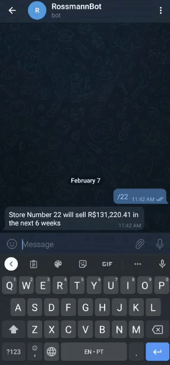

# Rossmann Store - Forecasting Sales

# 1. CONTEXT

Rossmann operates over 3,000 drug stores in 7 European countries. Currently, Rossmann store managers are tasked with predicting their daily sales for up to six weeks in advance. Store sales are influenced by many factors, including promotions, competition, school and state holidays, seasonality, and locality. With thousands of individual managers predicting sales based on their unique circumstances, the accuracy of results can be quite varied.

## 1.1. BUSINESS PROBLEM

The business problem can be defined by four topics as follows:

* **Motivation**
    * During a meeting, the Rossmann's CFO requested the store managers a prediction of their daily sales for the next six weeks.

* **The problem's root cause**
    * The Rossmann's CFO wants to renovate each store by using part of the store's revenue in the next six weeks. 

* **The Stakeholder**
    * The CFO.

* **The solution format**
    * **Granularity:** 
      * Dailys sales for the next six weeks per store
    * **Problem type:** 
      * Forecasting problem (Regression)
    * **Delivery method:** 
      * Cell phone access by using Telegram

# 2. DATA

The datasets are in CSV format and can be found at the following kaggle link: https://www.kaggle.com/c/rossmann-store-sales/data.

## 2.1. FILES

The files used for the project are as follows:

* **train.csv** - historical data including Sales to train the model
* **test.csv** - historical data excluding Sales to test the model
* **store.csv** - supplemental information about the stores

## 2.2. DATA FIELDS

Most of the fields are self-explanatory. The following are descriptions for those that aren't.

* **Id:** an Id that represents a (Store, Date) duple within the test set
* **Store:** a unique Id for each store
* **Sales:** the turnover for any given day (What I am predicting)
* **Customers:** the number of customers on a given day
* **Open:** an indicator for whether the store was open: 0 = closed, 1 = open
* **StateHoliday:** indicates a state holiday. Normally all stores, with few exceptions, are closed on state holidays. Note that all schools are closed on public holidays and weekends. a = public holiday, b = Easter holiday, c = Christmas, 0 = None
* **SchoolHoliday:** indicates if the (Store, Date) was affected by the closure of public schools
* **StoreType:** differentiates between 4 different store models: a, b, c, d
* **Assortment:** describes an assortment level: a = basic, b = extra, c = extended
* **CompetitionDistance:** distance in meters to the nearest competitor store
CompetitionOpenSince[Month/Year] - gives the approximate year and month of the time the nearest competitor was opened
* **Promo:** indicates whether a store is running a promo on that day
* **Promo2:** Promo2 is a continuing and consecutive promotion for some stores: 0 = store is not participating, 1 = store is participating
* **Promo2Since[Year/Week]:** describes the year and calendar week when the store started participating in Promo2
* **PromoInterval:** describes the consecutive intervals Promo2 is started, naming the months the promotion is started anew. E.g. "Feb,May,Aug,Nov" means each round starts in February, May, August, November of any given year for that store

# 3. PROJECT MANAGEMENT METHOD

The management method used for this project was the CRISP-DM, which is a cyclic developing method focused on delivering a solution as soon as possible and then improving it in the next cycles. 

The steps performed are as follows: 

1. **Business problem understanding**
    * Defining the motivation, problem's root cause, who is the stakeholder and the solution format.

2. **Data Description**
    * Checking dimensions and data types to apply descriptive statistics methods to better understand the data fields and their characteristics;
    * Changing data types and filling NA's based on business assumptions. 

3. **Feature Engineering**
    * Creating new features and raising hypotheses to understand the phenomenon that is being modeled and its agents.

4. **Data Filtering**
    * Filtering rows and columns that are not relevant to solve the problem.

5. **Exploratory Data Analysis (EDA)**
    * Validating the business hypothesis;
    * Selecting the most important features to the model.

6. **Data Preparation**
    * Preparing the data to be used for the machine learning model.

7. **Feature Selection**
    * Selecting the most significant attributes to train the model.

8. **Machine Learning Modeling**
    * Testing different machine learning models to compare performance and choose one of them to solve the problem. 

9. **Hyperparameter Fine Tuning**
    * Fine tuning the model's hyperparameters to obtain a better performance;
    * Training the model.

10. **Error Interpretation**
    * Interpreting the erro's metrics (MAE, MAPE, RMSE and MPE) to convert to business language.

11. **Deploy Model to Production**
    * Deploying the model to a cloud service to be available for the stakeholder to consult the results by a Telegram bot.

# 4. RESULTS

## 4.1. MACHINE LEARNING MODEL

It was used five models divided in three categories for performance comparison:

* **Baseline Model**
    * Average Model
* **Linear Models**
    * Linear Regression
    * Linear Regression Regularized (Lasso)
* **Non-linear Models**
    * Random Forest Regressor
    * XGBoost Regressor

To get real performance values for this models, it was applied cross-validation for each one of them, evaluating the following metrics:

* **MAE** (Mean Absolute Error)
* **MAPE** (Mean Absolute Percentage Error)
* **RMSE** (Root Mean Squared Error)
* **MPE** (Mean Percentage Error)

   
|       Model Name          |        MAE CV       |    MAPE CV    |      RMSE CV       |
|:-------------------------:|:-------------------:|:-------------:|:------------------:|
| Linear Regression         |  2081.73 +/- 295.63 | 0.30 +/- 0.02 | 2952.52 +/- 468.37 |
| Linear Regression - Lasso	|  2116.38 +/- 341.50 | 0.29 +/- 0.01 | 3057.75 +/- 504.26 |
| Random Forest Regressor   |  837.78 +/- 218.38  | 0.12 +/- 0.02 | 1256.5 +/- 319.25  |
| XGBoost Regressor         |  1074.84 +/- 199.67 | 0.15 +/- 0.02 | 1540.63 +/- 278.07 |

   
According to the results, the best two models were Random Forest Regressor and XGBoost Regressor. As the XGBoost Regressor is a lighter model than the Random Forest and gives good results too, it was chosen to be the model to be used in production.

For the hyperparameter fine tuning, the random search strategy was used, because it's faster than the grid and bayesian search. Its performance increased as follows:

   
|       Model Name          |          MAE        |      MAPE     |        RMSE        |
|:-------------------------:|:-------------------:|:-------------:|:------------------:|
| XGBoost Regressor         |  670.08905	      |    0.098361   |          966.11029 |

## 4.2. BUSINESS PERFORMANCE

The model's performance was translated to business performance using the evaluated metrics along with the predicted revenue for the next six weeks.

The metrics meanings for the business performance are as follows:

* **MAE:** The absolute value of how much the predicted revenue could variate, up or down, in local currency.

* **MAPE:** How different are the predicted and actual revenue, in percentage. It indicates how difficult it is to predict revenue for a store. 

With these values I was able to calculate the best and worst scenario in terms of revenue, by adding and subtracting the MAE value to the prediction, respectively, as follows:

|  store  |    predictions   |   worst_scenario  |   best_scenario |    MAE   |   MAPE |   
|:-------:|:----------------:|:-----------------:|:---------------:|:--------:|:------:|           
|  112	  | 223963.23        |	223378.54        |	224547.92      |  584.68  |	0.089  |
|  564	  |	214992.18        |	214545.88        |	215438.49      |  446.30  |	0.075  |
|  370	  |	299569.31        |	298799.77        |	300338.84      |  769.53  |	0.099  |
|  183	  |	163555.82        |	162358.62        |	164753.03      |  1197.20 | 0.150  |

And the most difficult stores to predict the revenue based on the MAPE values are as follows:

|  store  |    predictions   |    MAE   |   MAPE |   
|:-------:|:----------------:|:--------:|:------:|       
| 292	  | 104452.70	     | 3286.83  | 0.552  |
| 909	  | 236264.10	     | 7630.52  | 0.515  |
| 876	  | 198541.93	     | 3917.18  | 0.293  |
| 595	  | 389204.87	     | 3784.00  | 0.264  |
| 722	  | 350199.31	     | 1916.30  | 0.257  |

The total performance of the model represented as the sum of the revenue for all stores are as follows:

|  Scenario       |    Values        |    
|:---------------:|:----------------:|    
| predictions	  | R$285,701,696.00 |  
| worst_scenario  |	R$284,950,541.82 |
| best_scenario	  | R$286,452,822.01 | 
   

# 5. DEPLOY

Two APIs were created to deploy the model in production. One to receive data and make predictions and the other to connect to Telegram's API to read the messages and send the results. They were published in Heroku to make it available for the users.   

The user needs to send a message to the bot with "/" followed by the store's number, and the bot will return the predicted revenue for the next six weeks as follows:

  

